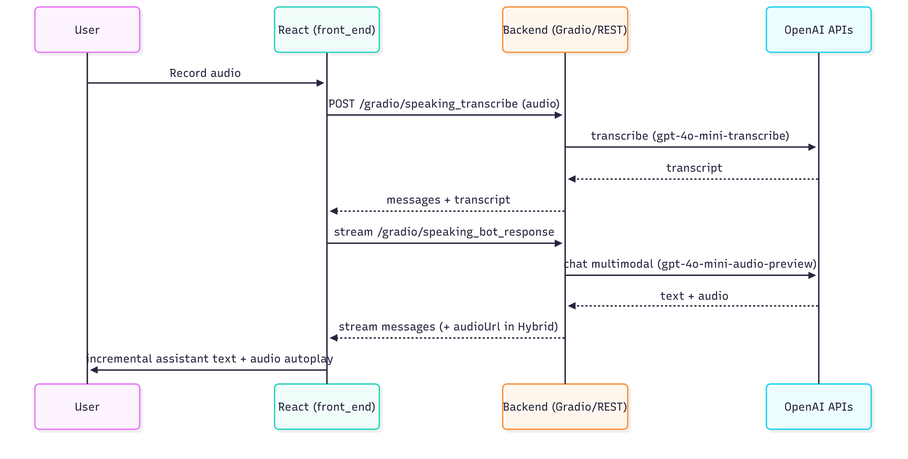

# 🎓 Sophia AI: Your Personal English Tutor

<div align="center">
  <p><strong>Sophia AI is a multimodal, AI-powered English tutor designed to accelerate language learning through immersive, interactive conversation and writing practice.</strong></p>
  <p>This project serves as a powerful demonstration of cutting-edge AI capabilities, creating a user experience that is both effective for students and compelling for investors.</p>

  [](https://www.python.org/)
  [](https://openai.com/)
  [](https://gradio.app/)
  [](https://opensource.org/licenses/MIT)

</div>

## 🌟 The Vision: The Future of Language Learning

The global market for language learning is massive and continues to grow. However, traditional methods often lack the personalization and interactivity needed for true fluency. Sophia AI addresses this gap by providing a scalable, on-demand tutor that simulates real-world conversation, offering a significant competitive advantage.

For an investor, Sophia AI represents an opportunity to enter the EdTech market with a product built on a modern, efficient, and highly engaging technology stack.

## ✨ Key Features & Technical Highlights

Sophia AI combines a user-friendly interface with a powerful backend to deliver a seamless learning experience.

### 1. Interactive Speaking Practice (Voice-to-Voice)

- **User Experience**: Students engage in natural, spoken conversations. They speak, and Sophia listens, transcribes, and responds with both text and a natural-sounding voice, creating a fluid and immersive practice environment.
- **Technical Magic**: This is powered by a single, efficient call to OpenAI's **`gpt-4o-mini-audio-preview`** model, which returns both a text response and its corresponding audio. This multimodal approach reduces latency and complexity, creating a responsive, real-time feel.

### 2. Real-Time Writing Feedback

- **User Experience**: Students receive instant, streaming feedback on their writing. As they submit their text, Sophia analyzes it and provides corrections and suggestions, appearing word-by-word as if a live tutor were typing.
- **Technical Magic**: We use **OpenAI's streaming API** to deliver feedback dynamically, enhancing engagement and providing immediate value.

### 3. Audio-Enhanced Learning

- **User Experience**: Don't just read your feedback—listen to it. A single click on the "🗣️" icon converts the written feedback into audio, reinforcing learning by connecting text with correct pronunciation and intonation.
- **Technical Magic**: This feature leverages OpenAI's **Text-to-Speech (TTS)** API, adding another layer of multimodal interaction.

## 🛠️ The Technology Stack: Built for Scale

Our architecture is designed to be modular, scalable, and efficient.

- **Backend**: Python 3.11 (Conda env `english-tutor-ai`)
- **AI & Machine Learning**: OpenAI API
  - **Multimodal Chat**: `gpt-4o-mini-audio-preview` (text + audio in one call)
  - **Text Streaming**: chat streaming with incremental UI updates
  - **Audio Transcription**: `gpt-4o-mini-transcribe` (Whisper)
  - **Text-to-Speech**: `tts-1`
- **Frontend**: React + TypeScript + Vite (folder `front_end/`)
- **UI Integration**: Gradio endpoints are mounted under `/gradio` and consumed by the React frontend
- **Dependency Management**: Conda + `requirements.txt` (backend) and npm (frontend)

## 🚀 Getting Started

### Prerequisites

- Python 3.11 (conda environment provided)
- An [OpenAI API Key](https://openai.com/)
- Conda (recommended) or venv
- Node.js 20+ and npm (for the React frontend)

### Installation & Setup

1. **Clone the repository:**

   ```bash
   git clone https://github.com/rc-ventura/english-tutor-ai.git
   cd english-tutor-ai
   ```
2. **Backend setup (Conda):**

   ```bash
   # create and activate the conda env
   conda env create -f environment.yml
   conda activate english-tutor-ai

   # alternatively (pip):
   pip install -r requirements.txt
   ```
3. **Launch the backend:**

   ```bash
   python main.py
   ```
4. **Frontend setup (React + Vite):**

   ```bash
   cd front_end
   npm install
   # set envs in front_end/.env (see front_end/.env.example)
   # VITE_GRADIO_BASE_URL=http://127.0.0.1:7860/gradio
   # VITE_API_BASE_URL=http://127.0.0.1:7860
   npm run dev
   ```
5. **Open the interface**

   - Frontend: `http://127.0.0.1:5173`
   - Gradio (debug): `http://127.0.0.1:7860`
6. **Set your OpenAI API Key**

   - Production/server: set `OPENAI_API_KEY` in the backend environment (see `.env.example`).
   - From the UI: open the Gradio sidebar → Settings → “OpenAI API Key” → Save. This uses the `set_api_key_ui` action defined in `ui/interfaces.py` and is also callable from the frontend via `setApiKey()` in `front_end/services/api.ts`.

## 🏗️ Project Architecture

The codebase is organized for clarity and maintainability, showcasing a professional development approach.

```
Sophia-AI-React-tsx/
├── front_end/                     # React + Vite frontend (TypeScript)
│   ├── components/                # UI components (e.g., SpeakingTab, Sidebar)
│   ├── services/                  # Gradio/REST API client (`api.ts`)
│   ├── docs/                      # Frontend docs (testing, watchdog)
│   ├── public/                    # Static assets
│   ├── package.json               # Frontend scripts and deps
│   └── .env.example               # Frontend envs (VITE_*)
├── src/
│   ├── core/                      # Tutors and orchestration
│   │   ├── tutor.py               # Entry orchestration
│   │   ├── speaking_tutor.py      # Speaking flow (multimodal)
│   │   └── writing_tutor.py       # Writing streaming flow
│   ├── infra/                     # Streaming, temp audio, infra
│   ├── utils/                     # Audio helpers, extractors
│   └── services/                  # OpenAIService, TelemetryService
├── ui/                            # Gradio UI mounting points/routes
├── tests/                         # Backend tests (pytest)
├── environment.yml                # Conda environment (english-tutor-ai)
├── requirements.txt               # Backend dependencies (pip)
└── main.py                        # Backend entrypoint (FastAPI/Gradio server)
```

## 🔮 Future Roadmap & Vision

Sophia AI is a strong foundation. Future enhancements could include:

- **Advanced Grammar Analysis**: Detailed explanations for grammatical errors.
- **Personalized Learning Paths**: Tracking student progress and suggesting specific exercises.
- **Vocabulary Builder**: Identifying and reinforcing new vocabulary.
- **Multiple Tutor Personas**: Allowing users to choose different voices and teaching styles.
- **Deployment to Cloud**: Packaging the application for scalable cloud deployment.

## 🤝 Contributing

Contributions are welcome! Please feel free to open an issue or submit a pull request.

1. Fork the project
2. Create your Feature Branch (`git checkout -b feature/AmazingFeature`)
3. Commit your Changes (`git commit -m 'Add some AmazingFeature'`)
4. Push to the Branch (`git push origin feature/AmazingFeature`)
5. Open a Pull Request

## 📄 License

Distributed under the MIT License. See `LICENSE` for more information.

## 📧 Contact

Rafael Ventura - [@linkedin](https://www.linkedin.com/in/dev-ventura) - r.c_ventural@hotmail.com

Github Link: [https://github.com/rc-ventura/english-tutor-IA](https://github.com/rc-ventura/english-tutor-IA)

Open Live production : [https://sophia-english-tutor-ai.vercel.app/](https://sophia-english-tutor-ai.vercel.app/) (Needs OpenAI API Key)

Open Live development : [https://huggingface.co/spaces/rcventura108000/Sophia-Ai-english-tutor](https://huggingface.co/spaces/rcventura108000/Sophia-Ai-english-tutor) (Not needs OpenAI API Key)

## 🙏 Acknowledgments

- [OpenAI](https://openai.com/) for providing the amazing API
- All contributors who helped improve this project
- The open-source community for all the support

---

## 🧠 Conceptual Model

This project delivers two core flows with cross-cutting resilience and observability.


#### Hybrid vs Immersive Streaming Modes

- Hybrid
  - After transcription, the user's text appears immediately in the chat.
  - During streaming, both assistant text and `audioUrl` are emitted; audio can autoplay as chunks arrive.
  - See `front_end/services/api.ts` → `handleTranscriptionAndResponse()` branch `practiceMode !== "immersive"`.

- Immersive
  - During streaming, the UI hides assistant text and prioritizes the audio player.
  - A single final `audioUrl` is emitted at the end; the bot audio player is rendered and autoplay starts.
  - UX sequence: user audio player → stream without text → bot audio player (autoplay).
  - See `front_end/services/api.ts` → `practiceMode === "immersive"` final emit after loop.


<hr>

### Speaking Tutor (Hybrid mode)

{ width=0.95\textwidth fig-align=center }

<hr>


#### Speaking Tutor (Immersive mode)

{ width=0.75\textwidth fig-align=center }

<hr>


### Writing Tutor (Streaming feedback)

{ width=0.95\textwidth fig-align=center }

## ⚙️ Configuration

- Backend `.env` (see `.env.example`):
  - `OPENAI_API_KEY` (required in production)
  - `AUDIO_RETRY_BACKOFF_MS`
  - `AUDIO_OUTPUT_FORMAT` (e.g., wav)
  - `AUDIO_TMP_DIR` (default `data/audio/tmp`)
  - `STREAM_TIMEOUT_MS` (e.g., 25000)
  - `SPEAKING_TEXT_CHUNK_WORDS` (e.g., 12)
  - `TELEMETRY_DIR`, `TELEMETRY_FLUSH_INTERVAL_MS`
- Frontend `.env` (see `front_end/.env.example`):
  - `VITE_GRADIO_BASE_URL` (e.g., `http://127.0.0.1:7860/gradio`)
  - `VITE_API_BASE_URL` (e.g., `http://127.0.0.1:7860`)
  - `VITE_SPEAKING_STEP_TIMEOUT_SEC` (default 25)
  - `VITE_VERBOSE_GRADIO_LOGS` (optional dev logs)

---

## 🔌 API and Endpoints

- Gradio endpoints (consumed by frontend via `@gradio/client`):
  - `POST /speaking_transcribe`
  - `STREAM /speaking_bot_response`
  - `STREAM|POST /generate_topic`
  - `STREAM|POST /evaluate_essay` (order: essay, history, level, type)
  - `POST /play_audio`
  - `POST /get_progress_html`
- REST endpoints (JSON):
  - `GET /api/progress`
  - `POST /api/speaking/metrics`
  - Escalations: `POST /api/escalations`, `GET /api/escalations[?status=]`, `GET /api/escalations/{id}`, `POST /api/escalations/{id}/resolve`, `GET /api/escalations/{id}/audio`

---

## ✅ Testing

- Backend (pytest):
  - `tests/test_streaming_manager_timeout.py` – inactivity timeout
  - `tests/test_streaming_manager.py`, `tests/test_speaking_tutor_cancel.py`
  - `tests/test_telemetry_service.py`
  - Run: `conda activate english-tutor-ai && pytest -q`
- Frontend (Vitest):
  - Streaming helpers in `front_end/services/api.test.ts`
  - Run: `cd front_end && npx vitest` (install if needed: `npm i -D vitest`)

---

## 🧪 Technical & Business Validation

- Technical
  - Cooperative cancellation and watchdog validated by `tests/test_speaking_tutor_cancel.py` and `tests/test_streaming_manager_timeout.py`.
  - Telemetry events emitted by `TelemetryService` validated in `tests/test_telemetry_service.py`.
  - Reproducible environment via Conda (`environment.yml`) and deterministic endpoints consumed by `front_end/services/api.ts`.
- Business
  - Defined KPIs: DAU/WAU/MAU, session duration, task completion, retention (D1/D7/D30), escalation resolution rate, CSAT/NPS.
  - Review cadence: monthly summaries from telemetry + qualitative feedback to inform roadmap prioritization and ROI alignment.

---

## ☁️ Deployment

- Frontend (Vercel):
  - Configure `VITE_GRADIO_BASE_URL` and `VITE_API_BASE_URL` to point to your backend
  - Live demo: https://sophia-english-tutor-85f5q4jkz.vercel.app/
  - On the live demo, enter your OpenAI API key via the sidebar Settings to enable requests.
- Backend (Server/Cloud):
  - Run `python main.py` behind a reverse proxy (ensure `/gradio` path is exposed)
  - Provide public base URL for the frontend env vars

---

## 🧪 User Testing Plan

1) Concept validation with target learners (A2–C1):
   - Speaking Hybrid vs Immersive latency and clarity
   - Writing streaming comprehension and usefulness
2) Structured scenarios and success criteria:
   - Turn-taking, audio autoplay acceptance, error recovery perception
3) Record findings and iterate:
   - Adopt immediate transcript display (Hybrid), watchdog timeouts, parsing hardening

---

## 📊 Telemetry & Observability (Stage 2)

- TelemetryService (JSONL sink): counters/histograms for multimodal audio, streaming, TTS, transcription.
- Config via `TELEMETRY_DIR`, `TELEMETRY_FLUSH_INTERVAL_MS`.
- Suggested product metrics:
  - DAU/WAU/MAU, New vs Returning Users
  - Session count, session duration, speaking vs writing ratio
  - Completion rate per task, error/cancel rate, timeout occurrences
  - Retention (D1/D7/D30), NPS, CSAT after sessions
- Observability:
  - Log streaming latency distribution, chunk cadence, retry counts
  - Track audio generation success rate and fallback occurrences

---

## 💬 Feedback Collection

- In-app post-session modal:
  - 1–5 satisfaction, NPS (0–10), free-text feedback
  - Optional consent to contact and share anonymized logs
- Backend endpoint (to add): `POST /api/feedback` storing JSONL or DB
- Close the loop: summarize top issues monthly and reflect changes in the README/CHANGELOG

---

## 🗺️ Roadmap (Expanded)

- Phase 1 — Stabilization and Core UX (done/ongoing)
  - Multimodal speaking, streaming writing, watchdog, cancellation, telemetry hooks
- Phase 2 — Deploy + Telemetry & Feedback
  - Deploy frontend to Vercel and share demo link in README
  - Harden telemetry dashboards; define product KPIs (retention, sessions, success)
  - Implement in-app feedback modal and `/api/feedback`
- Phase 3 — Limited Pilot (Free beta)
  - Invite a small cohort of English learners (e.g., course groups)
  - Collect qualitative/quantitative feedback; iterate on UX and pedagogy
- Phase 4 — Teacher Dashboard and Profiles
  - Escalations triage UI, user profiles, progress JSON API maturity
- Phase 5 — Pronunciation Lab and Institutional tooling
  - Advanced metrics, exercises, cohort analytics
